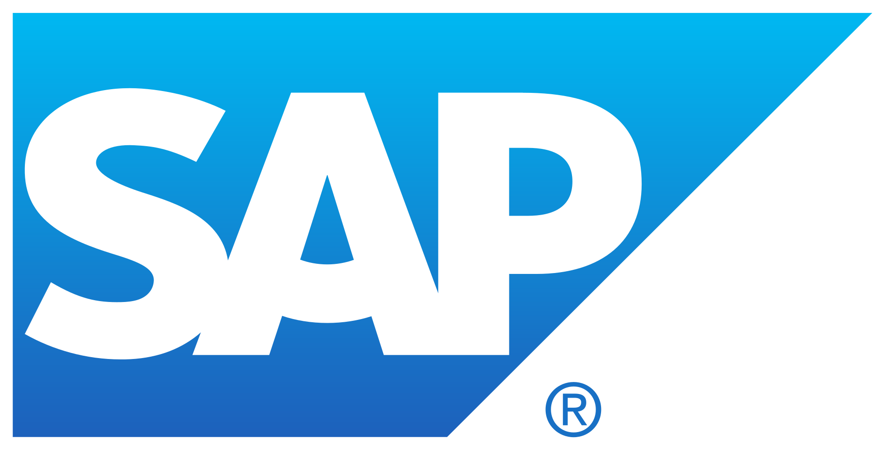
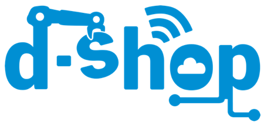

# D-Shop-Status-Board

## *Mission*
Currently there is no way for the D-Shop Team @ SAP Toronto to continuosly showcase the many Innovations and Events being worked on within the community. For that reason many individuals are unaware of the amazing work the Dshop Team is doing. 

Therefore, in order to spread more awareness about Dshop's efforts among customers, SAP employees and partners, we are creating the D-Shop Status-Board. 

It will display details regarding any active projects, events in the near future as well as the current Toronto D-Shop Committee.

## *Summary*
The App aims to create a way for people, whether they be customers, employees or business partners, to see the active projects that indivudals are working on as well as any events that D-Shop may be hosting. D-Shop aims to empower individuals to learn the skills they need to take their innovative ideas and manifest them. The App stands by D-Shop's three principles: Community, Education and Innovation, by allowing individuals to easily see projects they can currently join, and worksops to sign up for in the near future. All of which, helps to fuel more innovation within the SAP Community. 

